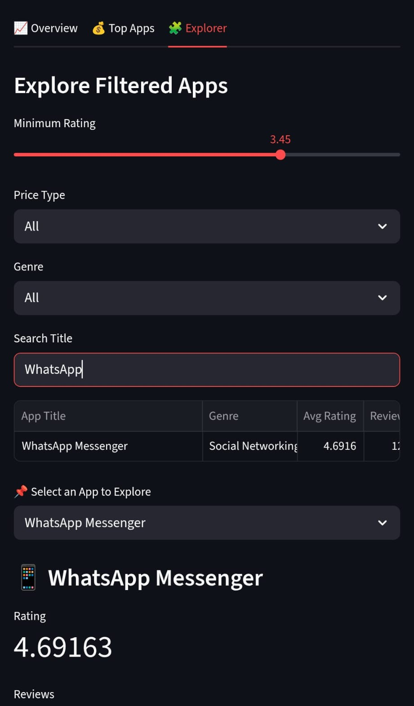
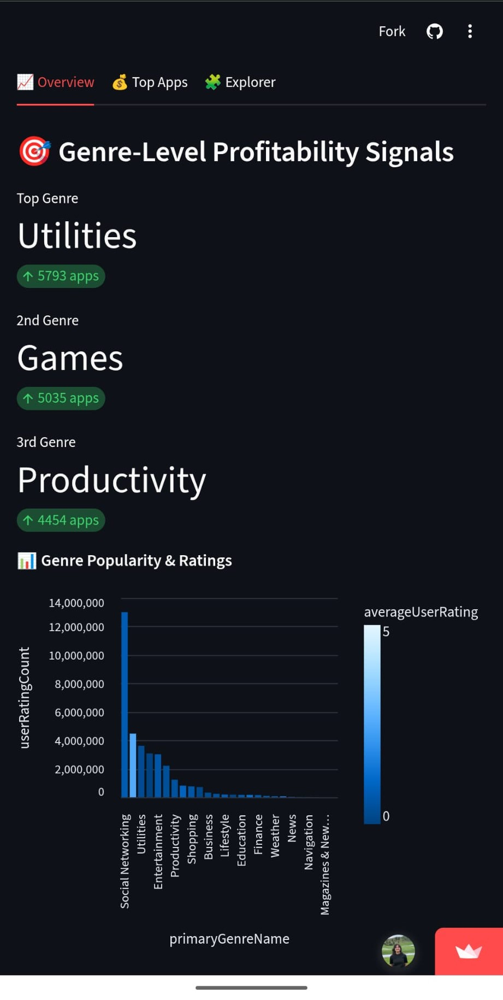

# App Store App Analysis

A modular Streamlit dashboard for analyzing mobile app performance across the App Store. Designed for product teams and data analysts, it delivers strategic insights into user engagement, monetization, and genre-level benchmarks.

---

## Dashboard Preview

Key visual modules:
- **Explorer**: Filter apps by rating, price, genre, and title. View rating percentile, z-score, price vs. rating plots, and keyword extraction.
- **Top Apps**: Grid of high-rated, high-engagement apps with KPI cards and scatterplots.
- **Overview**: Genre popularity, rating distributions, and advisory category breakdowns.

---

## ⚙️ Features

### Explorer Module  
- Dynamic filters: rating threshold, price type, genre, title keyword  
- App drilldowns:  
  - Rating percentile (genre-relative)  
  - Review volume z-score  
  - Price vs. rating scatterplot  
  - Rating histogram  
  - NLP keyword extraction
  

### Top Apps Module  
- 4×3 grid of top apps  
- KPI cards: highest-rated & most-reviewed  
- Price vs. rating scatterplot  

### Overview Module  
- Genre-level popularity & rating trends  
- Advisory category distribution  
- Contextual insights on “Not Yet Rated” apps
- 

---

## Data Sources

- `overview.parquet`: genre, advisory, rating metadata  
- `top_apps.parquet`: monetization & engagement metrics  
- `explorer.parquet`: filtered subset for drilldowns  

---

## Value Proposition

- Identify standout apps by genre  
- Correlate pricing models with user satisfaction  
- Benchmark with normalized metrics  
- Explore update cadence & keyword positioning  

---

## Tech Stack

- **Streamlit**: dashboard framework  
- **Pandas**: data manipulation  
- **Altair & Seaborn**: visualizations  
- **Scikit-learn**: NLP keyword extraction  
